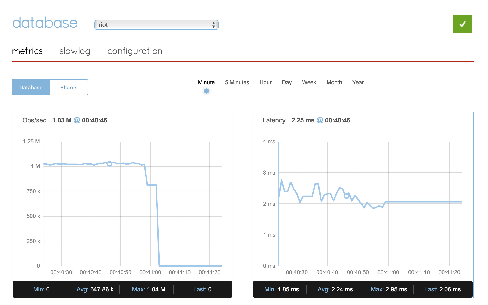

= RIOT
:source-highlighter: highlightjs
:idprefix:
:idseparator: -
:toc:
:icons: font
:project-repo: Redislabs-Solution-Architects/riot
:repo-url: https://github.com/{project-repo}

== Connectors

[#files]
=== Files

RIOT can import/export files in these formats:

* Delimited (CSV, TSV)
* Fixed-Width
* JSON
* XML (repeating elements not supported)

Files can be local or remote, and GZIP compressed:

* `/myfolder/myfile.csv`
* `/myfolder/myfile.json.gz`
* `https://example.com/path/dataset.csv`
* `s3://mybucket/myfolder/myfile.json`

For AWS S3 you can specify access and secret keys as well as the region for the bucket.

TIP: Use `-` to import/export from/to standard input/output 

[#db]
=== Databases

RIOT can connect to SQL databases through JDBC. Install the appropriate JDBC driver under the `lib` directory and modify the RIOT `CLASSPATH` accordingly:

* *nix: `bin/riot` -> `CLASSPATH=$APP_HOME/lib/myjdbc.jar:$APP_HOME/lib/…`

* Windows: `bin\riot.bat` -> `set CLASSPATH=%APP_HOME%\lib\myjdbc.jar;%APP_HOME%\lib\…`
 

For reference here are links to common database systems and related JDBC driver documentation:

* https://docs.oracle.com/cd/E11882_01/appdev.112/e13995/oracle/jdbc/OracleDriver.html[Oracle]
+
`jdbc:oracle:thin:@myhost:1521:orcl`

* https://www.ibm.com/support/knowledgecenter/en/SSEPEK_10.0.0/java/src/tpc/imjcc_r0052342.html[IBM Db2]
+
`jdbc:db2://host:port/database`

* https://docs.microsoft.com/en-us/sql/connect/jdbc/building-the-connection-url?view=sql-server-2017[MS SQL Server]
+
`jdbc:sqlserver://[serverName[\instanceName][:portNumber]][;property=value[;property=value]]`

* https://dev.mysql.com/doc/connector-j/8.0/en/connector-j-reference-jdbc-url-format.html[MySQL]
+
`jdbc:mysql://[host]:[port][/database][?properties]`

* https://www.postgresql.org/docs/7.4/jdbc-use.html[PostgreSQL]
+
`jdbc:postgresql://host:port/database`

* https://www.sqlitetutorial.net/sqlite-java/sqlite-jdbc-driver/[SQLite]
+
`jdbc:sqlite:sqlite_database_file_path`

[#gen]
=== Generators

RIOT can be used to create random data in Redis with 2 different generators.

* The simple generator produces the following fields:
** `index`: monotonous integer sequence
** `partition`: index of the partition (thread) generating the data, e.g. if you have 8 threads generating data each will have a different partition index between 0 and 7
** configurable fixed-sized fields using `--field <name=size>` options

* The Faker generator relies on the https://github.com/DiUS/java-faker[Faker] library. Supported data types are described <<faker#,here>>.

[#redis]
=== Redis

The Redis connector allows for replicating data between two Redis databases using scan and optionally keyspace notifications (`--listener`).

== Processors

RIOT can process records as they are being read. There are 2 processor approaches: field expressions or script processor.

=== Field expressions

You can specify field expressions to process key/value pairs using the https://docs.spring.io/spring/docs/current/spring-framework-reference/core.html#expressions[Spring Expression Language] (SpEL): `field1=<exp>`, `field2=<exp>`, ...

The input record is accessed through its field names (e.g. `field3=field1+field2`).

The processor also exposes the following variables that can be called with the `#` prefix:

* `redis`: Redis connection to issue any command, e.g. `name=#redis.hgetall('person1').lastName`
* `date`: date parser/formatter, e.g. `epoch=#date.parse(mydate).getTime()`
* `context`: exposes processor context, e.g. `id=#context.index`

[source,shell]
----
include::{commandsdir}/import-csv-processor-hash-dateformat.txt[]
----

=== Script evaluator

Use an external or inline script to provide the processor logic.

.Javascript example
[source,javascript]
----
function process(item) {
    item.name = item.name.toUpperCase();
    return item;
}
process(item);
----

[source,shell]
----
include::{commandsdir}/gen-faker-script-processor-hash.txt[]
----

== Examples

=== Files

.Import CSV
[source,shell]
----
include::{commandsdir}/import-csv-hash.txt[]
----

.Import JSON
[source,shell]
----
include::{commandsdir}/import-json-hash.txt[]
----

.Import CSV into RediSearch
[source,shell]
----
include::{commandsdir}/import-csv-search.txt[]
----

.Export CSV
[source,shell]
----
include::{commandsdir}/export-csv.txt[]
----

.Export JSON
[source,shell]
----
include::{commandsdir}/export-json.txt[]
----

.Export compressed JSON
[source,shell]
----
include::{commandsdir}/export-json_gz.txt[]
----

=== Databases

.Import from a database
[source,shell]
----
include::{commandsdir}/import-db.txt[]
----

.Export to a database
[source,shell]
----
include::{commandsdir}/export-db.txt[]
----

=== Generators

.Generate hashes using simple generator
[source,shell]
----
include::{commandsdir}/gen-simple.txt[]
----

.Generate hashes using Faker
[source,shell]
----
include::{commandsdir}/gen-faker-hash.txt[]
----

.Generate Redis sets using Faker
[source,shell]
----
include::{commandsdir}/gen-faker-set.txt[]
----

.Generate RediSearch data using introspection
[source,shell]
----
include::{commandsdir}/gen-faker-index-introspection.txt[]
----

=== Replication

.Live replication from `localhost:16379` to `localhost:16380`
[source,shell]
----
include::{commandsdir}/replicate-live.txt[]
----

== Load Testing

=== Metrics
Use the `--metrics` option to show latency metrics when using the Lettuce driver:
[source,shell]
----
riot --metrics …
----
[source,plaintext]
----
{[local:any -> localhost/127.0.0.1:6379, commandType=SET]=[count=401, timeUnit=MICROSECONDS, firstResponse=[min=116, max=7274, percentiles={50.0=197, 90.0=458, 95.0=606, 99.0=1081, 99.9=7274}], completion=[min=128, max=8519, percentiles={50.0=219, 90.0=489, 95.0=634, 99.0=1122, 99.9=8519}]]}
{[local:any -> localhost/127.0.0.1:6379, commandType=SET]=[count=1403, timeUnit=MICROSECONDS, firstResponse=[min=48, max=704, percentiles={50.0=99, 90.0=156, 95.0=183, 99.0=280, 99.9=573}], completion=[min=49, max=909, percentiles={50.0=108, 90.0=171, 95.0=205, 99.0=317, 99.9=581}]]}
{[local:any -> localhost/127.0.0.1:6379, commandType=SET]=[count=1684, timeUnit=MICROSECONDS, firstResponse=[min=56, max=516, percentiles={50.0=80, 90.0=124, 95.0=142, 99.0=183, 99.9=391}], completion=[min=58, max=520, percentiles={50.0=82, 90.0=127, 95.0=146, 99.0=188, 99.9=403}]]}
----

=== Using Redis Enterprise
.Strings
[source,shell]
----
$ riot -s redis-12001.redislabs.com:12001 --max-total 96 gen --batch 5000 --threads 96 --max 100000000 --command set --keyspace hash --keys index --value index
----

.Streams
[source,shell]
----
$ riot -s redis-12001.internal.jrx.demo.redislabs.com:12001 --max-total 96 gen --batch 5000 --threads 96 --max 100000000 --command xadd --keyspace stream --keys partition
----
image::images/rs-streams.png[]