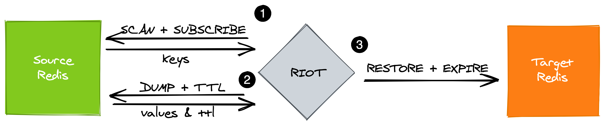

= RIOT Redis
:source-highlighter: highlightjs
:idprefix:
:idseparator: -
:toc: macro
:sectanchors:
:icons: font
:project-repo: Redislabs-Solution-Architects/riot
:repo-url: https://github.com/{project-repo}
:path: ../../..
:resources: {path}/riot-connectors/riot-redis/src/test/resources

== Overview

Most of the database migration tools available today are offline in nature. Migrating data from AWS ElastiCache to Redis Enterprise Cloud for example means backing up your Elasticache data to an AWS S3 bucket and importing it into Redis Enterprise Cloud using its UI. This implies some downtime and might result in data loss. Other available techniques include creating point-in-time snapshots of the source Redis server & applying the changes to the destination servers to keep both servers in sync. It might sound like a good approach but can be challenging when you have to maintain dozens of scripts to implement the migration strategy. 

*riot-redis* is a migration tool that allows for replicating data between two Redis databases. It implements client-side replication using a producer/consumer approach:

* The producer is connected to the source Redis (e.g. ElastiCache) and is composed of
** key reader: calls `SCAN` and optionally `SUBSCRIBE` to listen for keyspace notifications (*live* replication)
** value reader: takes keys from the key reader and calls `DUMP` and `TTL`
* The resulting key/value/ttl tuples are passed to the consumer connected to the target Redis (e.g. Redis Enterprise Cloud) which calls `RESTORE` and `EXPIRE`.

TIP: Live replication makes use of keyspace notifications. Make sure the source Redis database has keyspace notifications enabled using `notify-keyspace-events = KA` in `redis.conf` or via CONFIG SET.

== Examples

.Live replication from localhost:6379 to localhost:6380
[source,shell]
----
include::{resources}/replicate-live.txt[]
----